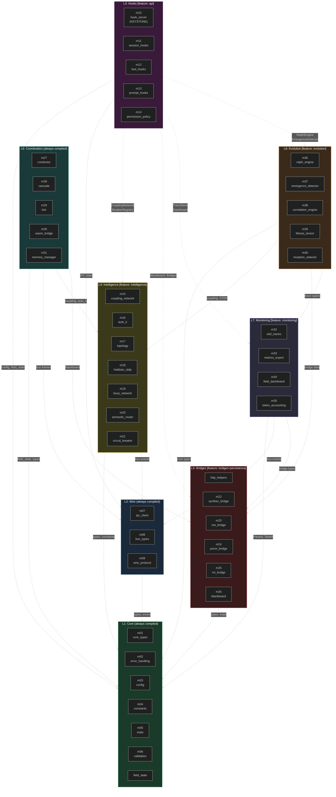
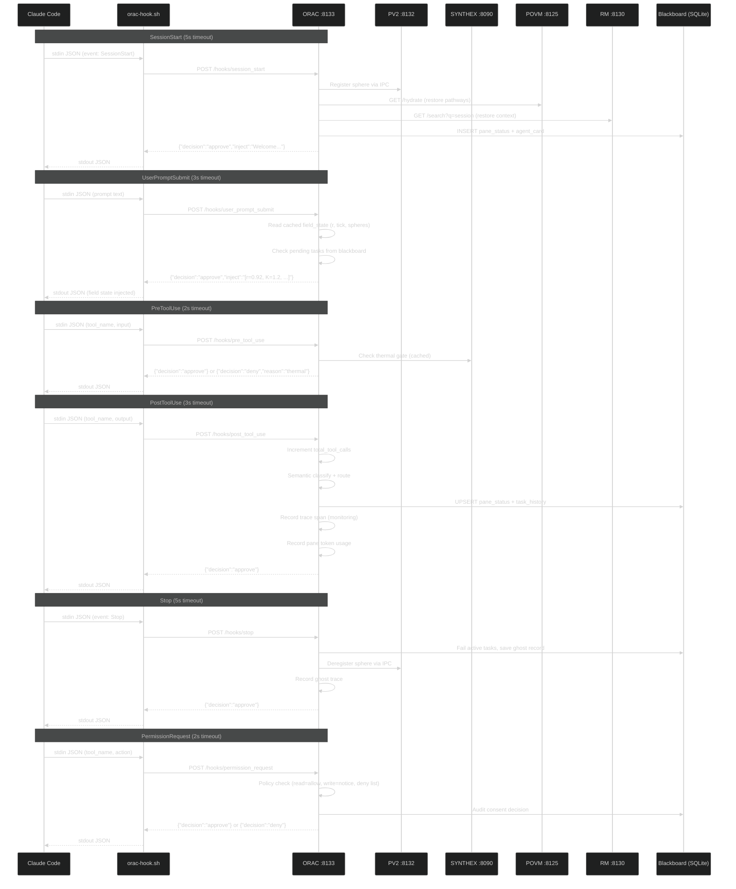
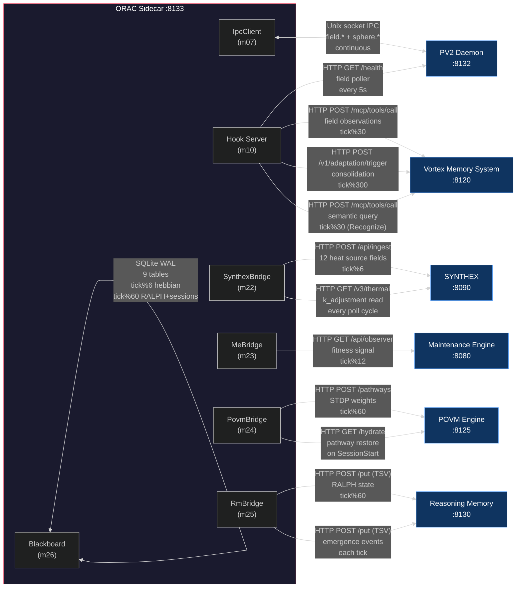
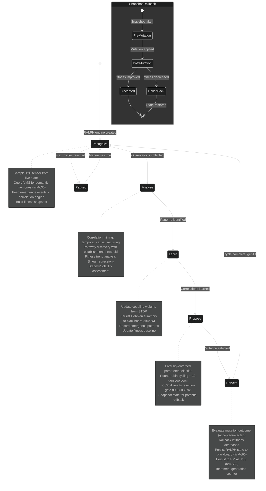
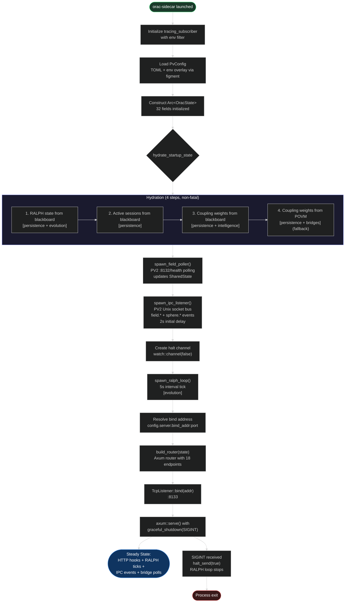

# D8: ORAC Sidecar -- Mermaid Diagrams

> **Version:** 0.6.0 | **Verified:** 2026-03-25 (Round 3 corrected module names)
> **8 diagrams** covering architecture, hooks, bridges, RALPH, IPC, state, startup, and data flow

---

## Diagram 1: Corrected Layer Architecture

All 40 modules with verified names, feature gates as subgraph labels, dependency arrows between layers.



---

## Diagram 2: Hook Lifecycle Sequence

All 6 hook events showing the flow from Claude Code through the shell forwarder to ORAC and back, including bridge side effects.



---

## Diagram 3: Bridge Topology

ORAC's connections to 6 external services with data flow direction, protocol, and tick cadences.



---

## Diagram 4: RALPH Evolution State Machine

The 5-phase RALPH cycle: Recognize, Analyze, Learn, Propose, Harvest. Shows transitions, triggers, and side effects.



---

## Diagram 5: IPC Wire Protocol State Machine

V2 wire protocol FSM for PV2 bus connection: Disconnected through Active with reconnection handling.

```mermaid
%%{init: {'theme': 'dark'}}%%
stateDiagram-v2
    [*] --> Disconnected

    Disconnected --> Handshaking: connect_with_backoff() success
    note right of Disconnected
        Initial state or after recv error
        Escalating backoff: 5s base, 30s cap
        Total reconnects tracked
    end note

    Handshaking --> Connected: Handshake frame exchanged
    note right of Handshaking
        Send: ClientHello with PaneId
        Recv: ServerWelcome with session_id
        V2 wire format validation
    end note

    Connected --> Subscribing: subscribe() called
    note right of Connected
        Connection established
        Session ID assigned
        Ready for subscription
    end note

    Subscribing --> Active: Subscribe ACK received
    note right of Subscribing
        Subscribe to: field.*, sphere.*
        Configurable via PvConfig.ipc.subscribe_patterns
        Count of matched patterns returned
    end note

    Active --> Active: BusFrame::Event received
    note right of Active
        process_bus_event() dispatches:
        - field.tick / field.state --> update cached r, psi
        - sphere.registered --> add to spheres map
        - sphere.deregistered --> remove from spheres map
        - sphere.status --> update phase
        - unknown --> no-op
    end note

    Active --> Disconnected: recv error or timeout
    Handshaking --> Disconnected: handshake failed
    Connected --> Disconnected: connection lost
    Subscribing --> Disconnected: subscribe failed

    note left of Disconnected
        On disconnect:
        - client.disconnect() to release socket
        - ipc_state = "disconnected"
        - Backoff delay before retry
        - Backoff resets on successful connect
    end note
```

---

## Diagram 6: OracState Field Diagram

All 32 fields grouped by subsystem with feature gate annotations.

```mermaid
%%{init: {'theme': 'dark'}}%%
graph TB
    subgraph CONFIG["Configuration (5 fields)"]
        cfg["config: PvConfig"]
        pv2["pv2_url: String"]
        syn_url["synthex_url: String"]
        povm_url["povm_url: String"]
        rm_url["rm_url: String"]
    end

    subgraph CORE["Core State (5 fields)"]
        fstate["field_state: SharedState<br/>(RwLock&lt;AppState&gt;)"]
        sess["sessions: RwLock&lt;HashMap&gt;"]
        tick["tick: AtomicU64"]
        ipc["ipc_state: RwLock&lt;String&gt;"]
        ghosts["ghosts: RwLock&lt;VecDeque&gt;"]
    end

    subgraph GOV["Governance (1 field)"]
        cons["consents: RwLock&lt;HashMap&gt;"]
    end

    subgraph PERSIST["Persistence (1 field) #91;persistence#93;"]
        bb["blackboard: Option&lt;Mutex&lt;Blackboard&gt;&gt;"]
    end

    subgraph EVOL["Evolution (1 field) #91;evolution#93;"]
        ralph["ralph: RalphEngine"]
    end

    subgraph INTEL["Intelligence (2 fields)"]
        coup["coupling: RwLock&lt;CouplingNetwork&gt;"]
        brk["breakers: RwLock&lt;BreakerRegistry&gt;<br/>#91;intelligence#93;"]
    end

    subgraph DISPATCH["Dispatch Counters (5 fields)"]
        dt["dispatch_total: AtomicU64"]
        dr["dispatch_read: AtomicU64"]
        dw["dispatch_write: AtomicU64"]
        de["dispatch_execute: AtomicU64"]
        dc["dispatch_communicate: AtomicU64"]
    end

    subgraph HEBBIAN["Hebbian Tracking (4 fields)"]
        coact["co_activations_total: AtomicU64"]
        ltp["hebbian_ltp_total: AtomicU64"]
        ltd["hebbian_ltd_total: AtomicU64"]
        hlast["hebbian_last_tick: AtomicU64"]
    end

    subgraph BRIDGES["Bridge Instances (3 fields) #91;bridges#93;"]
        meb["me_bridge: MeBridge"]
        rmb["rm_bridge: RmBridge"]
        sxb["synthex_bridge: SynthexBridge"]
    end

    subgraph TOOLS["Tool Tracking (2 fields)"]
        ttc["total_tool_calls: AtomicU64"]
        tclt["tool_calls_at_last_thermal: AtomicU64"]
    end

    subgraph MON["Monitoring (3 fields) #91;monitoring#93;"]
        traces["trace_store: TraceStore"]
        dash["dashboard: FieldDashboard"]
        tokens["token_accountant: TokenAccountant"]
    end

    style CONFIG fill:#1a3a2a,stroke:#4ade80,color:#fff
    style CORE fill:#1a2a3a,stroke:#60a5fa,color:#fff
    style GOV fill:#2a2a3a,stroke:#c084fc,color:#fff
    style PERSIST fill:#3a1a1a,stroke:#f87171,color:#fff
    style EVOL fill:#3a2a1a,stroke:#fb923c,color:#fff
    style INTEL fill:#3a3a1a,stroke:#facc15,color:#fff
    style DISPATCH fill:#1a3a3a,stroke:#2dd4bf,color:#fff
    style HEBBIAN fill:#2a1a3a,stroke:#a78bfa,color:#fff
    style BRIDGES fill:#3a1a2a,stroke:#fb7185,color:#fff
    style TOOLS fill:#1a2a2a,stroke:#67e8f9,color:#fff
    style MON fill:#2a3a2a,stroke:#86efac,color:#fff
```



---

## Diagram 7: Daemon Startup Sequence

The `orac-sidecar` main.rs startup flow from process launch to steady state.



---

## Diagram 8: Cross-Service Data Flow with Cadences

All data pipelines between ORAC and external services, annotated with tick cadences (1 tick = 5 seconds).

```mermaid
%%{init: {'theme': 'dark'}}%%
graph TB
    subgraph ORAC["ORAC Sidecar :8133"]
        RALPH["RALPH Engine<br/>5s tick interval"]
        STDP["Hebbian STDP<br/>every tick"]
        EMERGE["Emergence Detector<br/>every tick"]
        TENSOR["Fitness Tensor<br/>12D, every tick"]
        CONDUCTOR["Conductor<br/>every tick"]
    end

    subgraph PV2_SVC["PV2 :8132"]
        PV2_H["HTTP /health"]
        PV2_IPC["IPC Bus (Unix socket)"]
    end

    subgraph SYN_SVC["SYNTHEX :8090"]
        SYN_ING["/api/ingest"]
        SYN_TH["/v3/thermal"]
        SYN_DEC["/v3/decay/trigger"]
    end

    subgraph ME_SVC["ME :8080"]
        ME_OBS["/api/observer"]
    end

    subgraph POVM_SVC["POVM :8125"]
        POVM_PW["/pathways"]
        POVM_HY["/hydrate"]
    end

    subgraph RM_SVC["RM :8130 (TSV only)"]
        RM_PUT["POST /put"]
        RM_SEARCH["GET /search"]
    end

    subgraph VMS_SVC["VMS :8120"]
        VMS_MCP["/mcp/tools/call"]
        VMS_ADAPT["/v1/adaptation/trigger"]
    end

    subgraph BB_SVC["Blackboard (SQLite)"]
        BB_RALPH["ralph_state table"]
        BB_SESS["sessions table"]
        BB_COUP["coupling_weights table"]
        BB_HEB["hebbian_summary table"]
        BB_PANE["pane_status table"]
    end

    %% PV2 flows
    ORAC -->|"HTTP GET<br/>continuous (5s)"| PV2_H
    PV2_IPC -->|"field.tick / sphere.*<br/>continuous stream"| ORAC

    %% SYNTHEX flows
    RALPH -->|"tick%6 (30s)<br/>12 heat source fields"| SYN_ING
    ORAC -->|"every poll cycle<br/>k_adjustment read"| SYN_TH
    ORAC -->|"once<br/>PID reset on first ingest"| SYN_DEC

    %% ME flows
    ORAC -->|"tick%12 (60s)<br/>fitness signal"| ME_OBS

    %% POVM flows
    STDP -->|"tick%60 (5min)<br/>top 10 weights"| POVM_PW
    ORAC -->|"on SessionStart<br/>pathway restore"| POVM_HY

    %% RM flows
    RALPH -->|"tick%60 (5min)<br/>RALPH state TSV"| RM_PUT
    EMERGE -->|"each tick<br/>new emergence events TSV"| RM_PUT
    ORAC -->|"on SessionStart<br/>context restore"| RM_SEARCH

    %% VMS flows
    RALPH -->|"tick%30 (2.5min)<br/>field observation memory"| VMS_MCP
    RALPH -->|"tick%30 in Recognize<br/>semantic query (k=5)"| VMS_MCP
    ORAC -->|"tick%300 (25min)<br/>consolidation trigger"| VMS_ADAPT

    %% Blackboard flows
    RALPH -->|"tick%60 (5min)"| BB_RALPH
    RALPH -->|"tick%60 (5min)"| BB_SESS
    STDP -->|"tick%60 (5min)"| BB_COUP
    STDP -->|"tick%6 (30s)"| BB_HEB
    ORAC -->|"on PostToolUse"| BB_PANE

    %% Internal flows
    TENSOR -->|"every tick"| RALPH
    STDP -->|"every tick"| TENSOR
    EMERGE -->|"every tick"| RALPH
    CONDUCTOR -->|"every tick"| ORAC

    style ORAC fill:#1a1a2e,stroke:#e94560,color:#fff
    style PV2_SVC fill:#0f3460,stroke:#60a5fa,color:#fff
    style SYN_SVC fill:#0f3460,stroke:#60a5fa,color:#fff
    style ME_SVC fill:#0f3460,stroke:#60a5fa,color:#fff
    style POVM_SVC fill:#0f3460,stroke:#60a5fa,color:#fff
    style RM_SVC fill:#0f3460,stroke:#60a5fa,color:#fff
    style VMS_SVC fill:#0f3460,stroke:#60a5fa,color:#fff
    style BB_SVC fill:#2a1a3a,stroke:#a78bfa,color:#fff
```



### Cadence Reference Table

| Pipeline | Direction | Cadence | Real Time (1 tick = 5s) |
|----------|-----------|---------|------------------------|
| PV2 field poller | ORAC -> PV2 | every tick | 5s |
| PV2 IPC bus | PV2 -> ORAC | continuous | sub-second |
| SYNTHEX ingest | ORAC -> SYNTHEX | tick%6 | 30s |
| SYNTHEX thermal | SYNTHEX -> ORAC | every poll cycle | ~5s |
| ME observer | ORAC -> ME | tick%12 | 60s |
| POVM pathway persist | ORAC -> POVM | tick%60 | 5min |
| POVM hydrate | POVM -> ORAC | on SessionStart | event-driven |
| RM state persist | ORAC -> RM | tick%60 | 5min |
| RM emergence relay | ORAC -> RM | each tick | 5s (when events exist) |
| VMS memory post | ORAC -> VMS | tick%30 | 2.5min |
| VMS semantic query | VMS -> ORAC | tick%30 (Recognize) | 2.5min |
| VMS consolidation | ORAC -> VMS | tick%300 | 25min |
| Blackboard RALPH | ORAC -> SQLite | tick%60 | 5min |
| Blackboard sessions | ORAC -> SQLite | tick%60 | 5min |
| Blackboard coupling | ORAC -> SQLite | tick%60 | 5min |
| Blackboard hebbian | ORAC -> SQLite | tick%6 | 30s |
| Blackboard pane_status | ORAC -> SQLite | on PostToolUse | event-driven |
| Blackboard prune | ORAC -> SQLite | tick%60 | 5min |
| Homeostatic normalization | internal | tick%120 | 10min |
| STDP pass | internal | every tick | 5s |
| RALPH tick | internal | every tick | 5s |
| Emergence detection | internal | every tick | 5s |
| Conductor advisory | internal | every tick | 5s |
| Breaker FSM tick | internal | every tick | 5s |
